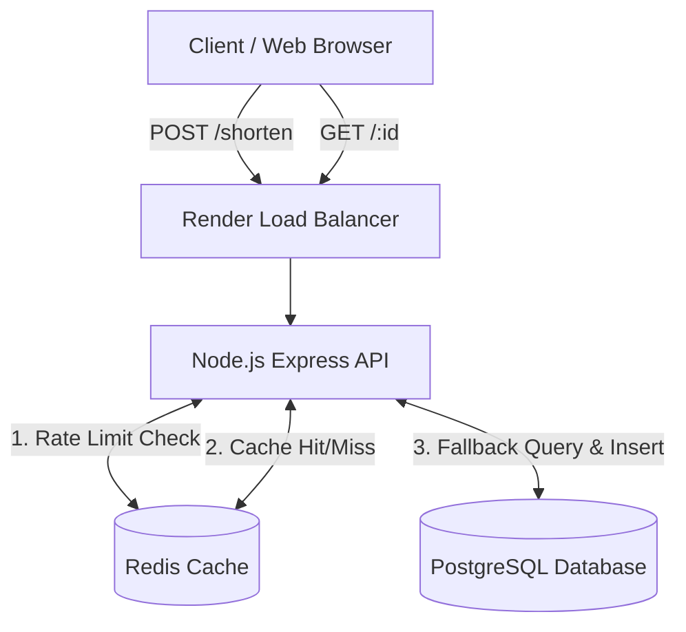

# Gravity Links - High-Performance URL Shortener

Gravity Links is a full-stack, highly scalable URL shortener built for speed, performance, and real-time analytics. It utilizes a three-tier architecture (Frontend, API Server, Database + Cache) and implements enterprise-level optimizations such as Base62 encoding, Redis caching, and fixed-window rate limiting.

## 🚀 Tech Stack
- **Frontend:** React, TypeScript, Vite, CSS Glassmorphism
- **Backend:** Node.js, Express.js, TypeScript
- **Database:** PostgreSQL (via Prisma ORM)
- **Caching & Rate Limiting:** Redis
- **Deployment:** Vercel (Frontend), Render.com (Backend API + Databases)

---

## 🏗️ System Architecture

The application is structured to handle high volumes of traffic without overloading the primary database.



### 1. The Load Balancer
When the backend is deployed to Render, it sits behind Render's load balancers. The Express API uses `app.set('trust proxy', 1)` to correctly extract the user's true IP address from the `X-Forwarded-For` headers instead of logging the load balancer's IP.

### 2. Redis Caching (O(1) Reads)
To prevent the PostgreSQL database from crashing under heavy read-traffic, the system uses **Redis**.
When a user visits a short link:
1. The API checks Redis for the long URL.
2. If found (**Cache Hit**), it instantly redirects the user (O(1) time complexity).
3. If not found (**Cache Miss**), it queries PostgreSQL (O(log N)), redirects the user, and saves the result in Redis for the next 1 hour.

### 3. Rate Limiting
To protect against DDoS attacks and spam, the `POST /shorten` route is protected by a Fixed Window Rate Limiter using Redis. It limits users to 10 link generations per minute based on their IP address.

---

## ⚙️ Core Algorithms & Optimizations

### Base62 Encoding
Instead of generating random strings (which can cause database collisions), the shortener generates unique IDs mathematically. 
1. The long URL is inserted into PostgreSQL, generating an auto-incrementing integer ID (e.g., `10024`).
2. That Base10 integer is converted into a **Base62 string** using the alphabet `[0-9a-zA-Z]`. 
3. `10024` becomes `2BB`. 
This guarantees absolute uniqueness and creates the shortest possible URLs.

### Database Query Optimization
When a user attempts to shorten a URL, the system first runs a `findFirst` query to check if that exact Long URL already exists in the database. If it does, it returns the *existing* short link. This consolidates analytics and prevents the database from ballooning in size with duplicate entries.

### Fire-and-Forget Analytics
When a short link is visited, the user is redirected *immediately*. The system does not wait for the database to finish logging the analytics. The `prisma.click.create()` function is fired asynchronously in the background, ensuring 0ms of added latency for the user.

---

## 🗄️ Database Schema

The database is built on PostgreSQL using Prisma ORM.

```prisma
model Link {
  id          Int      @id @default(autoincrement())
  shortId     String   @unique
  originalUrl String
  createdAt   DateTime @default(now())
  clicks      Click[]
}

model Click {
  id        Int      @id @default(autoincrement())
  shortId   String
  ip        String?
  userAgent String?
  createdAt DateTime @default(now())
  link      Link     @relation(fields: [shortId], references: [shortId])
}
```

---

## 🔌 API Endpoints

### 1. Shorten URL
- **Endpoint:** `POST /shorten`
- **Body:** `{ "originalUrl": "https://youtube.com/..." }`
- **Behavior:** Checks rate limit -> Checks if URL exists -> Inserts temporary row -> Encodes Base62 ID -> Updates row -> Returns Short URL.

### 2. Redirect
- **Endpoint:** `GET /:id`
- **Behavior:** Checks Redis cache -> Fallback to PostgreSQL -> Redirects user (302) -> Logs Analytics asynchronously.

### 3. Get Analytics
- **Endpoint:** `GET /stats/:id`
- **Behavior:** Fetches link metadata, total clicks, and an array of individual click data. It parses the IP addresses to calculate and return the total number of **Unique Visitors**.
