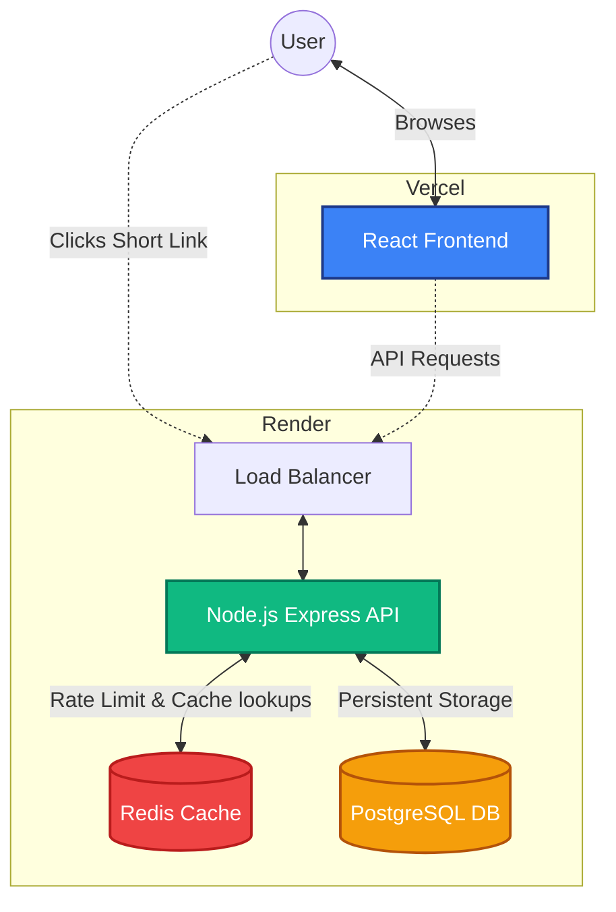
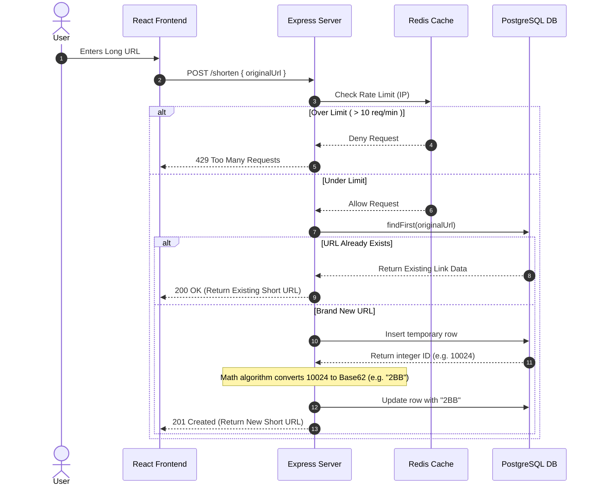
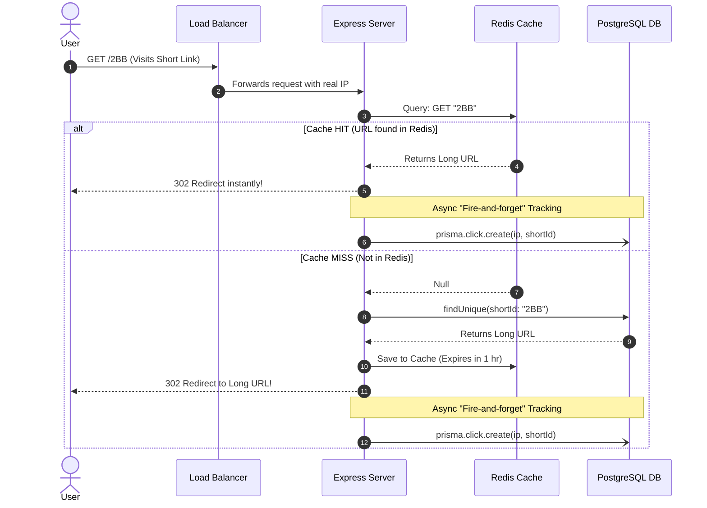
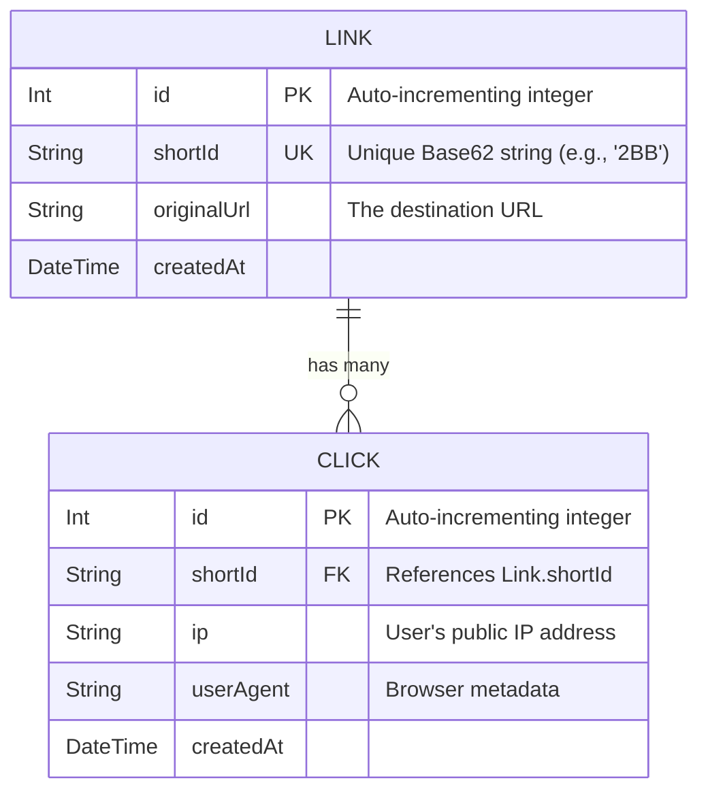

# Gravity Links: Architecture & Data Flows

This document contains detailed system diagrams to help you study the architecture, explain it in interviews, or use it for future reference.

---

## 1. High-Level System Architecture
This diagram outlines the physical deployment architecture and how the different services talk to each other across the internet.

---

## 2. The "URL Shortening" Flow (`POST /shorten`)
This diagram shows the exact logical sequence of events that happens when a user clicks the "Shorten" button in the React UI. Notice how we optimize the database by checking for existing URLs first.

---

## 3. The "Redirect & Analytics" Flow (`GET /:id`)
This is the most critical performance path in the app. This diagram demonstrates how we use Redis to achieve O(1) response times, and how we use "Fire-and-Forget" asynchronous operations to log analytics without slowing down the user.

---

## 4. Entity Relationship Diagram (ERD)
This represents the relational architecture of your PostgreSQL database tables.

